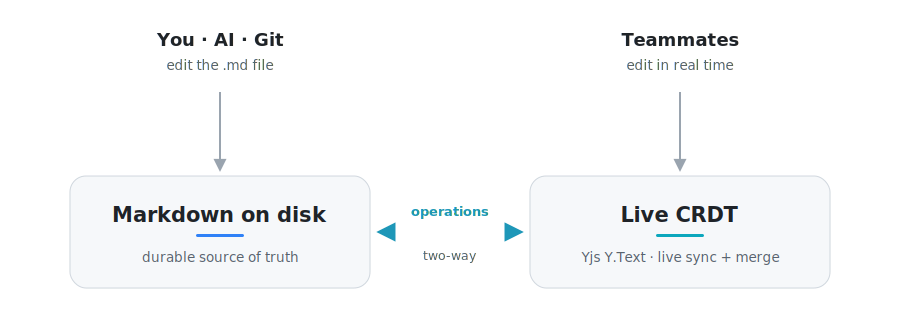

<div align="center">

# Baalda

**The team second brain. Plain Markdown files on your disk, edited together in real time, and read and written by your AI like a teammate.**


**[baalda.com](https://baalda.com)** · [Download](https://baalda.com/download) · [Docs](docs/Baalda.md) · [Pricing](https://baalda.com/pricing)

</div>

<div align="center">

<!-- Inline player: edit this file in GitHub's web editor and drag the product film mp4 onto the line below. GitHub inserts a user-attachments URL that renders as a play-in-place player. -->

[▶ Watch the product film](https://github.com/naveedharri/baalda/raw/main/docs/baalda-product-film.mp4)

</div>

---

## What is Baalda?

Baalda is a local-first desktop app for notes and knowledge: your second brain. Every note is a plain `.md` file on your own disk, so your data is always yours. What makes Baalda different is that those same files are:

- **Editable by AI.** Because notes are plain files, a local agent like Claude Code edits them right on your disk with zero setup. Cloud and autonomous agents connect through the built-in MCP endpoint. Either way, the AI works your notes like a teammate would.
- **Shared in real time.** Invite people, share a folder, and edit the same note together with live cursors.

You get the openness of local Markdown files *and* the collaboration of a shared doc, in one app.

---

## Why it exists

AI is only as good as the context you give it. A team that wants one shared, always-current context layer quickly discovers that every existing tool forces a choice:

| You can have… | …but not… |
|---|---|
| Notes as plain files an AI can edit | Real-time team collaboration |
| Real-time team collaboration | Notes as plain files an AI can edit |

Why? The two are built on incompatible foundations. AI-editable notes need loose Markdown on disk as the source of truth. Real-time collaboration is built on CRDTs, whose state is an opaque binary blob. No tool combined them.

We scanned **41** open-source Obsidian-like apps against **12 core requirements** and none satisfied all 12. Baalda is the missing bridge between the two worlds, and that bridge is the whole product.

---

## Highlights

- 📄 **Your notes are just files.** Plain `.md` on disk. No lock-in, works with Git, and survives even if the server disappears.
- 🤖 **AI-editable, two ways.** Local-first means a local agent (Claude Code, Codex, any CLI tool) edits the `.md` files directly, no integration needed. Autonomous and cloud agents use the built-in [MCP](#-connect-an-ai-mcp) endpoint, gated by the exact same permissions as a human. Both paths merge live with everyone else's edits.
- 👥 **Real-time collaboration.** Invite teammates, share folders or single files (view or edit), and see live cursors and who's viewing a note.
- 🔒 **Local-first and private.** A full desktop app that works offline. Your Markdown never travels the network in plain text; only opaque binary sync updates do, and each device re-derives its own `.md` files.
- 🔎 **Fast search and links.** Built-in full-text search (SQLite FTS5), backlinks, and tags, all indexed locally.
- 🖥️ **Native and cross-platform.** A lightweight Tauri v2 app for macOS, Windows, and Linux (iOS planned).
- 🛠️ **Self-hostable.** Runs entirely on your own infrastructure (Tauri + Node + Postgres). No vendor lock-in.
- 📎 **Attachments included.** Images and files sync alongside your notes.

---

## Built to scale

Baalda is built to grow with you, from a personal vault to a whole company:

| | |
|---|---|
| 📚 **Millions of notes** | a workspace keeps growing without slowing down |
| 👥 **Thousands of teammates online** | connected and kept in sync at the same time |
| ✍️ **Hundreds editing together** | people writing in the same space, live |
| ⚡ **Instant open** | notes are already up to date before you click, no waiting |

Need more? It scales out to handle **tens of thousands** of people at once.

---

## How it works

The core idea in one sentence: **the `.md` file on disk is the durable source of truth, and a live CRDT keeps every open copy in sync.**

- When you (or an AI) change a file, a watcher turns the change into CRDT **operations**.
- When a teammate edits the shared note, those operations flow back and are written to your file.

Every change funnels through the same CRDT as operations, never whole-file overwrites. Whether it comes from a person typing, an AI rewriting a paragraph, or a teammate across the world, edits **merge** instead of overwriting each other.

<div align="center">

<picture>
  <source media="(prefers-color-scheme: dark)" srcset="docs/assets/bridge-dark.svg">
  
</picture>

</div>

Everything else (the desktop app, the search index, the sync server) is a rebuildable layer on top of your files.

---

## Tech stack

| Layer | Choice |
|---|---|
| Desktop shell | **Tauri v2** (Rust core) |
| UI | **React + Vite + TypeScript** |
| Editor | **CodeMirror 6** |
| Files & watcher | **Rust** (`std::fs` / `tokio::fs`) |
| Local index | **SQLite** (FTS5 search + backlinks + tags) |
| Real-time sync | **Yjs** CRDT + **Hocuspocus** server |
| Database | **Postgres** (binary sync store) |
| Accounts & teams | **Better Auth** (argon2id, organizations) |
| AI access | **MCP** (Model Context Protocol) endpoint |

---

## Getting started

### Prerequisites

- **Node.js** ≥ 22
- **Rust** & Cargo ([rustup.rs](https://rustup.rs))
- **Docker** (for the Postgres database)

### 1. Install dependencies

```bash
cd app
npm install
```

### 2. Start the server

```bash
cd apps/server
cp .env.example .env      # adjust JWT_SECRET for anything real
npm run db:up             # start Postgres in Docker (host port 5439)
npm run migrate           # create the database schema
npm run dev               # HTTP API :3010 · sync WS :3011 (also served at :3010/sync)
```

### 3. Start the desktop app

From the `app/` directory:

```bash
npm run dev:desktop       # launches the Tauri app (Vite on :1420)
```

Open a folder of Markdown files (or create a new one) and start writing.

### Prefer not to run a server?

Everything above is self-hosted and free. If you'd rather skip the backend ops,
[baalda.com](https://baalda.com) offers a managed backend for multi-device sync,
real-time team collaboration, and hosted AI. The desktop app is identical either
way: in Settings, set the server URL to `https://api.baalda.com` (managed) or to
your own instance.

Want to run the server yourself in Docker or on Railway instead of your laptop?
See [`docs/DEPLOY.md`](docs/DEPLOY.md).

<!-- Deploy on Railway button goes here once a template is published from the
     Railway dashboard (Project → Settings → generate template). The button
     URL is generated at publish time, so this stays a placeholder until then. -->

---

## 🤖 Connect an AI (MCP)

A **local** agent needs no setup at all: point Claude Code (or any tool) at your vault folder and it edits the `.md` files directly. The watcher picks up every change and syncs it live to your team.

For **cloud and autonomous agents** that can't reach your disk, Baalda exposes a **Model Context Protocol** endpoint, so any MCP-speaking AI client can work with your vault exactly like a person, limited by the same per-folder permissions.

1. In the app, go to **Workspace settings → MCP** and create a token.
2. Register the endpoint with your AI client, e.g. Claude Code:

```bash
claude mcp add --transport http context http://localhost:3010/api/mcp \
  --header "Authorization: Bearer mcp_…"
```

(On the managed service the endpoint is `https://api.baalda.com/api/mcp`; for a
self-hosted server, use your server URL plus `/api/mcp`.)

The AI can now `read_note`, `search_notes`, `create_note`, `update_note`, and more. Its writes flow through the same sync engine, so if the note is open you'll watch the AI type in real time.

---

## Project structure

```
app/
├── apps/desktop/   Tauri v2 app: Rust core (src-tauri/) + React/Vite/TS UI (src/)
└── apps/server/    Node/TS: Hono HTTP + Hocuspocus sync + Postgres + Better Auth + MCP
docs/               Product overview, build status, specs, and reference research
```

Deep dives live in [`docs/`](docs/): the [product overview](docs/Baalda.md), the design [specs](docs/specs/), and the [build status](docs/STATUS.md).

---

## Contributing

Issues and pull requests are welcome. If you're planning a larger change, please open an issue first to discuss it. Read the design docs in [`docs/`](docs/) to understand the architecture before diving in.

---

## License

Baalda is open source under the **[Apache License 2.0](LICENSE)**. Use it,
self-host it, modify it, and build commercial products on it, freely.

The **Baalda** name and brand are trademarks and are **not** covered by the
code license; see the [Trademark Policy](TRADEMARK.md). You're welcome to fork
and run the code; please give your version its own name.

Contributions are welcome under the same license, with **no CLA required**. See
[CONTRIBUTING.md](CONTRIBUTING.md), and report vulnerabilities via
[SECURITY.md](SECURITY.md).

> One exception: the [`ee/`](ee/) directory holds future commercial-only
> features under a separate [Enterprise License](ee/LICENSE). Everything else,
> the entire core, is Apache-2.0.
